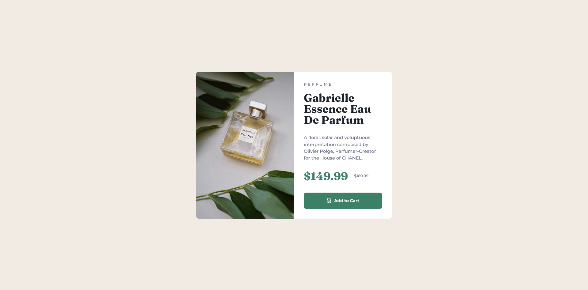

# Frontend Mentor - Product preview card component solution

This is a solution to the [Product preview card component challenge on Frontend Mentor](https://www.frontendmentor.io/challenges/product-preview-card-component-GO7UmttRfa). Frontend Mentor challenges help you improve your coding skills by building realistic projects. 

## Table of contents

- [Overview](#overview)
  - [The challenge](#the-challenge)
  - [Screenshot](#screenshot)
  - [Links](#links)
- [My process](#my-process)
  - [Built with](#built-with)
  - [What I learned](#what-i-learned)
  - [Continued development](#continued-development)
  - [Useful resources](#useful-resources)
- [Author](#author)

## Overview

### The challenge

Users should be able to:

- View the optimal layout depending on their device's screen size
- See hover and focus states for interactive elements

### Screenshot



### Links

- Solution URL: [GitHub](https://github.com/mbdelarosa/product-preview-card-component-main)
- Live Site URL: [Product Preview Card Component](https://mbdelarosa.github.io/product-preview-card-component-main)

## My process

### Built with

- Semantic HTML5 markup
- CSS custom properties
- Flexbox
- CSS Grid
- Mobile-first workflow

### What I learned

Learnings from this challenge:
- Better use of the BEM naming convention (compared to my submitted solutions for other challenges)
- Different ways on how to include screen reader-only text to describe the text-level styling (e.g. showing the old price with a line through it)
  - For this challenge, I decided to use the `<del>` tag to denote the old price, and used a pseudo-element to include the sr-only text (referenced from [Adrian Roselli's "Tweaking Text Level Styles"](https://adrianroselli.com/2017/12/tweaking-text-level-styles.html))
    ```css
    del::before {
      clip-path: inset(100%);
      clip: rect(1px, 1px, 1px, 1px);
      height: 1px;
      width: 1px;
      overflow: hidden;
      position: absolute;
      white-space: nowrap;
      content: " Old price: ";
    }
    ```
- What a "Ribbon text" is, and that we can use the paragraph tag for it (as it is definitely NOT a heading)

### Continued development

Looking forward to learning and implementing best practices and design principles to make websites more accessible.

### Useful resources

This [article from FED Mentor](https://fedmentor.dev/posts/html-plan-product-preview/) was highly recommended as a read for this challenge, and it helped a lot to understand how to better structure the HTML—focusing on using proper semantics that also makes way for accessibility. I like how they showed that each component is carefully considered in a way that should be simple and sensible.

## Author

- Frontend Mentor - [@mbdelarosa](https://www.frontendmentor.io/profile/mbdelarosa)